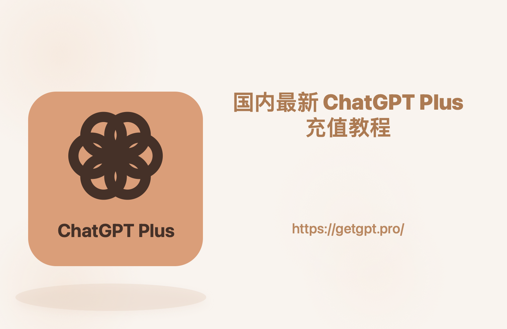

# 
[亲测可用]2026 年国内开通 ChatGPT Plus 的几种姿势：哪种最省心？哪种坑最多？一篇讲透

本教材最新更新时间：2026年5月14日, 安全可用

ChatGPT Plus 是真的香——GPT-5.5 又快又能打，Deep Research、代码执行、文件分析、画图一条龙伺候，体验和免费版完全是两回事。但国内用户想自己给它充值，会卡在**国内信用卡被拒、IP 不被支持、Stripe 支付页死循环、3D Secure 验证不过、礼品卡黑卡、账号被风控封禁**等一连串坑里（完整的 10 类常见报错及排查办法放在文末附录，可对照排查）。这两年我把几种主流路子全都跑过一遍，下面就一次性掰开揉碎讲清楚，尽量让你少踩坑、少走弯路。

------

## 方法一：海外虚拟信用卡（适合喜欢 DIY 的折腾党）

- **适合谁：** 技术上不怵、愿意自己一步步搞定、未来还想订阅 Claude / Netflix / Spotify 等其他海外服务的人。
- **核心原理：** 注册一个海外发卡平台，拿到一张虚拟 Visa/Mastercard，然后挂美区 IP 在 ChatGPT 官网直接绑卡支付。

🚨 **2026 年的现实警告：** 2025 年下半年开始，国内主流的几家海外虚拟卡平台因跨境支付合规审查陆续退出运营，之前那种"国内充值 + 一键开卡 + 美区 IP 套件"的傻瓜玩法基本宣告终结。现在还在运营的几家海外虚拟卡平台，门槛全都拉满了：

- 开卡费 + 月费 + 充值手续费叠起来一年多花不少钱
- **必须过 KYC**（身份证 + 人脸识别），跨境数据合规问题自己掂量
- 大多**只支持 USDT 充值**，门槛对普通人极不友好
- 平台跑路风险悬在头上（这两年已有不止一家头部虚拟卡平台先后退场，老用户余额基本无解）

**实操步骤大概是这样：**

1. 找一家目前还在运营的海外虚拟卡平台，完成 KYC 实名
2. 用 USDT（或其他平台支持的方式）充值美元
3. 准备美区 IP 环境——**必须是干净的住宅 IP**，机房 IP 分分钟触发风控
4. 打开 ChatGPT 官网，点 Upgrade to Plus，填卡号、有效期、CVV、美国账单地址，提交

**优点：**

- 最"官方直接"的方式，相当于你自己就是个海外用户
- 一卡多用，能订阅其他需要海外信用卡的服务
- 账号完全自主，不依赖第三方代充

**缺点 / 注意事项：**

- 网络环境门槛超高——IP 不干净分分钟失败
- 各种费用叠起来比 20 美金贵不少
- KYC 流程麻烦，对隐私敏感的人不友好
- 平台跑路风险是悬在头上的剑

------

## 方法二：苹果 App Store 礼品卡（仅限苹果用户）

- **适合谁：** 有 iPhone/iPad、能接受切换 Apple ID 区域的朋友。
- **核心原理：** 把 Apple ID 切换到美区，买美区 App Store 礼品卡充值到余额，然后在 iOS 版 ChatGPT App 内通过苹果内购订阅 Plus。

**步骤大概是这样：**

1. **切换 Apple ID 到美区**（一次性操作，但有点折腾）
   - 需要美国地址、邮编、电话（这些都可以虚拟）
   - **切换前会清空现有订阅和余额，操作前务必想清楚**
2. **购买美区礼品卡**
   - 途径 A：支付宝 → 出境 → 惠出境 → App Store & iTunes 充值 → 选美国 → 输金额
   - 途径 B：淘宝/闲鱼买卡密（**有买到黑卡的风险**，要找信誉高的）
3. **兑换到美区 Apple ID**：App Store → 头像 → Redeem Gift Card or Code → 输码
4. **在 iOS 版 ChatGPT App 内订阅**：登录账号 → 升级 Plus → 支付方式选 "Apple ID Balance"

**优点：**

- 走的是苹果官方内购，安全性还可以
- 整个流程在苹果生态内闭环，对 iPhone 用户比较熟悉

**缺点 / 注意事项：**

- **只有 iPhone/iPad 用户能玩**——安卓、网页、Mac 用户绕道
- 切区操作有风险，可能影响你原有的订阅和服务
- 这两年苹果礼品卡风控收紧得离谱，操作不当就会触发封号
- **淘宝礼品卡卡密如果买到黑卡**（盗刷得来的），整个 Apple 账号都可能受牵连
- 续费和取消都要在苹果的订阅设置里操作

------

## 方法三：第三方代充网站（目前最省心省力的方案）✅

- **适合谁：** 怕折腾、不想搞虚拟卡、网络环境一般、或者就想几分钟搞定的朋友。
- **核心原理：** 你用人民币（支付宝/微信）付钱给国内有备案的代充平台，平台用企业级海外ios/卡 + 干净的美国住宅 IP，帮你在 OpenAI 官方完成 Plus 订阅。你拿到的是真·官方 Plus 会员，绑在你自己的 ChatGPT 账号上，全程不用把账号密码交出去。
- **为啥这两年最流行：** 操作简单（基本就是支付宝付一下钱）、几分钟到账、安卓/iOS/网页/Mac 全平台都能用，走的是 OpenAI 官方支付通道，封号风险极低。

⚠️ 重点先讲：选代充平台一定一定要认准 **支付通道正规 + 自助充值（不用交账号密码）+ 明确售后承诺** 这三条，不然就是给自己挖坑。我自己跑过几家，目前最稳、最省心、价格也最厚道的就是下面这家。

[GETGPT Pro](https://getgpt.pro/) 是目前国内 ChatGPT 代充这条赛道里我用得最顺手的一家，原因就一句话——**该有的都有，售后靠谱**：

- **支付：** 支持支付宝/微信，付的是人民币，到账几秒就完事。
- **充值模式：** 全自助充值，**不需要你提供 ChatGPT 账号密码**。隐私这一关从源头就堵死了，别人想偷你账号都没机会。
- **覆盖范围：** 安卓/iOS/网页/桌面端全平台通用，升级后哪儿都能登。
- **售后：** 充值失败原路退款；账号端如果出问题，客服会跟进处理，不是付完款就消失那种。
- **入口直白：** 官网 [https://getgpt.pro/](https://getgpt.pro/) 套餐和价格都明牌挂着，不需要先加客服微信再"谈"。

**操作流程也简单到离谱：**

1. 打开 [https://getgpt.pro/](https://getgpt.pro/)
2. 选你要的套餐(plus\pro 等都支持）
3. 用支付宝或微信付款
4. 按页面提示完成账号绑定 → 几秒后回 ChatGPT 刷新一下，Plus 标识就出来了

整个过程基本不需要"教程"——比起前面折腾虚拟卡、切区、买礼品卡的那一套，这玩意儿简直是"一键开 Plus"。

### 代充网站这条路的优缺点总结

- **优点：**
  - **真方便**——支付宝/微信直接付人民币，不用折腾任何虚拟卡或者代理 IP。
  - **速度飞快**——GETGPT Pro 这种自助平台，付完款几秒到账。
  - **风险低**——正规平台用的是企业级海外卡 + 干净住宅 IP，封号率极低。
  - **全平台通用**——升级后你的账号在安卓/iOS/网页/桌面端全都能用。
- **缺点 / 注意事项：**
  - **依赖第三方**——所以必须找运营稳定、有真实售后承诺的平台，别图便宜去碰野鸡小作坊。
  - **价格随汇率有微调**——但相比官方 20 美金 + 海外信用卡门槛，整体性价比已经很高。
  - **🚨 隐私红线：** 靠谱的自助平台**绝不需要你提供 ChatGPT 账号密码**。一切让你交账号密码的小代充、个人代充，**绝对别用**！

------

## 方法四：共享账号（预算极紧 + 完全不在意隐私的最后选择）⚠️

- **适合谁：** 真·只是临时体验一下 GPT-5.4 长啥样、预算极低、且完全不在意自己聊啥都被别人看到的朋友。
- **核心原理：** 买一个商家提供的共享 ChatGPT Plus 账号，多人共用一个号。

**优点：**

- **便宜**——几十块就能"体验"上 Plus。

**缺点 / 注意事项（请逐条认真看）：**

- 🚨 **零隐私**——你和陌生人共用一个账号，**你聊的所有内容对方都能看到，对方聊的你也能看到**。聊工作、聊私事、贴文档贴代码 = 裸奔。
- **使用受限**——商家通常会限制"3 小时 50 条"之类的额度，体验很差。
- **极不稳定**——多人异地登录是 OpenAI 封号触发器，账号随时挂掉。
- **没有任何售后**——卖家改密码跑路、店铺一夜消失都很常见。

**我的态度：强烈不推荐。** 真要体验下 Plus 长啥样，多花几十块上 GETGPT Pro 买个月卡，不香吗？

------

## 我的大实话（一句话推荐）

经过这几年的折腾，我自己的结论是：

- **喜欢自己折腾，未来还要订其他海外服务？** **海外虚拟信用卡**还能勉强走通，但要做好高门槛 + KYC + 美区 IP 的心理准备。
- **只用 iPhone 且能接受切区？** **苹果礼品卡**还能跑，但 2026 年风控比前两年严太多，做好礼品卡作废的心理准备。
- **想省心省力，又快又稳，预算正常？** 闭眼上**代充网站**，首推 **<a href="https://getgpt.pro/">GETGPT Pro</a>** ——支付宝/微信直接付，自助充值不用交密码，几秒到账，对 99% 的国内普通用户都够用。
- **预算紧到不行 + 不在意隐私？** **淘宝共享账号**...能用，但代价巨大，建议慎选。

**最后提醒一句：** 不管选哪种姿势，一个**稳定、干净、能访问 ChatGPT 官网的网络环境**都是前提，没这个一切白搭。希望大家都能愉快地用上 GPT-5.4。

------

## 2026 年 ChatGPT 充值常见问题（精简版）

### Q1：ChatGPT 充值适合技术小白吗？

非常适合。国内主流虚拟卡平台陆续退出之后，对小白来说**代充网站基本是唯一可行的路**。像 GETGPT Pro 这种 24 小时自助平台，付钱 → 选套餐 → 自助升级，几分钟就完事，全程不用懂任何技术，也不用把账号密码交给任何人。

### Q2：淘宝/闲鱼上的个人代充能买吗？

**强烈不建议。** 这些个人卖家为了打价格战，大量使用"黑卡"（盗刷信用卡）或者即将作废的虚拟卡，OpenAI 风控一旦识别，你的账号 100% 永久封禁，聊天记录全部清空。而且这些店铺今天开明天关，售后基本指望不上。

### Q3：通过代充平台开 Plus 会封号吗？

正规大平台用的是企业级海外卡 + 干净住宅 IP，单纯因"代付动作"封号的概率非常低。绝大多数封号是用户后期使用过程中**网络节点不干净**导致的，跟代充本身无关。GETGPT Pro 也明确承诺：充值失败原路退款，账号端出问题客服会跟进处理，不会付完款就消失。

### Q4：怎么挑靠谱的代充平台？

5 个硬指标交叉对比，能筛掉 90% 的草台班子：

2. **看运营年限和真实口碑**——成立 1 年以上 + 社区评价 OK 的优先
3. **看支付方式**——支持支付宝/微信的可追溯渠道，只收 USDT 的格外小心
4. **看客服响应**——下单前先撩一下，看是真人还是机器人
5. **看售后条款**——白纸黑字的"充值失败全额退款 有售后"才算专业

### Q5：日常使用要注意什么？

代充平台帮你扫清的只是"支付环节"，账号能否长期稳定，要看你自己：

- **网络节点要干净稳定**——别用免费节点和"万人骑"IP，别频繁跨国切换
- **优先自助充值平台**——全程不用把账号密码交出去；万一必须人工代充，事后立刻改密码
- **提前 3–5 天续费**——别等会员过期了才操作，避免业务中断

### Q6：充值失败了怎么办？

先别慌。大多数情况是 OpenAI 临时风控收紧或者官网拥堵，**拿订单号联系平台客服**就行，正规平台会换卡段或专属 IP 重试。极端情况下确实无法成功的，正规平台都承诺原路全额退款。

### Q7：充值成功后能退款吗？

要分情况：**充值失败 → 100% 原路退款**；**已经成功开通且账号能正常用 → 不支持七天无理由退款**（Plus 属于虚拟数字商品，已交付即视为消费完成）。

### Q8：到期了怎么续费？

市面上大多数代充服务是"单月买断制"，到期不会自动扣款。到期前 3–5 天回原平台再下一单即可。**如果想彻底告别每月续费的麻烦**，直接上 GETGPT Pro 的长期套餐（比如 12 个月）——一次性付钱，平摊下来每月最便宜，省心又划算。

------

## 附录：国内自己给 ChatGPT 充值最常见的 10 个报错排查

下面这些坑是我自己以及身边十几个朋友实打实踩过的——**90% 的人在尝试自己给 ChatGPT Plus 充值时，都会卡在下面至少一条上**。如果你正打算用国内卡或自己折腾虚拟卡硬刚，对照这一节排查一下，别再无谓地累加账号风控分。

### 1. "Your credit card was declined" / 信用卡被拒（最高频）

这是出现频率最高的 ChatGPT 充值报错。原因 99% 是：**你用的是国内发行的 Visa / Mastercard 信用卡**。OpenAI 的支付系统（Stripe）会做 BIN 段识别，只要识别到中国大陆发卡行，不管你 IP 在哪、账单地址填的哪、信用卡额度多高，**直接拒付**。

**结论：用国内信用卡给 ChatGPT Plus 充值，目前没有任何方案能绕过。** 国内招行全币种、中信 i 白金、各大行 JCB——通通不行，别再问了。

### 2. "Country not supported" / 您所在的国家或地区暂不支持 ChatGPT Plus

代理 IP 落地不在 OpenAI 的支持区域内。中国大陆、香港、俄罗斯、伊朗、朝鲜、古巴等地区都不被支持。要绕过这条限制，你需要：

- 代理出口节点必须落在美国 / 英国 / 新加坡 / 日本 / 加拿大等 OpenAI 支持地区
- 必须是**干净的住宅 IP**（Residential IP），机房 IP（DataCenter）会被直接识别为代理拒付
- 不能频繁切换节点国家，OpenAI 会标记你的账号"行为异常"

很多人买的"机场"用的是机房 IP，看着能访问 ChatGPT，但到了支付页面就被卡死，原因就在这。

### 3. ChatGPT 升级按钮点了没反应 / Stripe 支付页面无限加载转圈

这是国内用户最容易碰到、也最让人崩溃的一类 ChatGPT 充值失败现象。点了 "Upgrade to Plus" 之后，要么页面空白、要么进度条卡死、要么 Stripe 支付窗口加载半天弹不出来。

可能的原因：

- 代理节点带宽小、丢包率高，Stripe 的 JS 资源加载不全
- 浏览器缓存了之前的失败状态
- 节点 IP 已经被 Cloudflare / Stripe 风控临时拉黑

可以试试：换一个稳定的美国住宅节点、用浏览器无痕模式 + 清缓存重试。但如果重试 3 次以上都失败，**强烈建议停手**，再试下去账号容易被打风控标签。

### 4. "Something went wrong, please try again later" / 充值时出错请稍后再试

OpenAI 临时风控收紧的明确信号。常见于：

- 同一 IP 在短时间内尝试多次支付
- 你用的虚拟卡 BIN 段已经被 OpenAI 标记
- 账号本身正在被风控系统审查

**遇到这个报错，账号通常需要冷却 24–48 小时再试。** 短时间内频繁触发，OpenAI 直接给你打"高风险账号"标签，后续不仅充不上 Plus，连免费版的对话都可能被限频。

### 5. 虚拟卡平台官网突然"无法访问" / DNS 解析失败

🚨 **重要提醒：前两年国内最常用的几家海外虚拟卡平台，已在 2025 年下半年因跨境支付合规审查陆续退出运营**，对应域名目前已无法访问。如果你是这些平台的老用户，卡内余额请尽快通过你保留的客服联系方式尝试申诉（实话说基本无望）。

**网上但凡看到"某某卡复活"、"卡服续命包"、"私域续期通道"之类的小道消息，99.9% 是钓鱼。** 千万别再往里扔钱了，这条路从根上就断了。

### 6. 苹果美区礼品卡兑换提示 "This code has already been redeemed"

你买到的是**黑卡**——通过盗刷信用卡、洗劫他人 Apple ID 余额或被举报的来源得来的卡密。淘宝、闲鱼、Telegram 群上那些"折扣 8 折美区礼品卡"，基本都有这个风险。

一旦黑卡兑换被 Apple 风控识别，你的整个 Apple ID 会被标记：余额清零、订阅取消、严重的连同 iCloud 数据一起冻结。**别拿主力 Apple ID 去赌这种小概率高代价的事。**

### 7. 美区 Apple ID 切换后无法登录 / 提示"该 Apple ID 未启用"

切区后 Apple ID 没有完成"美区激活"。Apple 要求新切区的账号必须在 App Store 进行过一次真实活动（下载免费 App 或兑换礼品卡）才算正式激活。

建议先用支付宝（出境 → 惠出境）买一张 10–25 美金的小额美区礼品卡兑换激活，再去操作 ChatGPT Plus 订阅。

### 8. ChatGPT Plus 充值成功了，但账号没有 Plus 标识

先做这三件事：

1. **完全退出账号重新登录**，或换浏览器无痕模式登录
2. **检查你充的是哪个邮箱**（很多人 Gmail / Outlook 多账号，钱付错了号）
3. **进 Settings → Plan 看订阅状态**

如果 1 小时内还是没有 Plus，去 OpenAI 邮箱搜 "Receipt from OpenAI" 邮件确认到底有没有扣款成功。

### 9. ChatGPT 提示 "Your account has been deactivated" / 账号已封禁

分两种情况：

- **充值前就被封：** 通常是 IP 风控、自动化滥用、违规内容触发。可以发邮件到 `support@openai.com` 申诉，但说实话申诉成功率不到 10%。
- **充值后被封：** 大概率是用了黑卡（被盗刷的卡）、人工代充时把账号给了不靠谱的小商家、或者多人共享账号。这种情况**基本无法恢复**。

这也是我们在文中反复强调的：**别贪便宜去淘宝 / 闲鱼上找个人代充和共享号，账号一旦被永久封，里面的所有对话历史、自定义 GPT、记忆数据全部清零。**

### 10. "We were unable to authenticate your payment method" / 3D Secure 二次验证失败

3D Secure 是 Visa / Mastercard 的二次验证机制，需要银行下发短信验证码。**国内信用卡基本没有接入海外 3D Secure 体系**，所以收不到验证短信，自然过不了这一关。这也是国内卡在 OpenAI 充值时几乎必然失败的另一个底层原因。

### 一句话总结

国内用户自己给 ChatGPT Plus 充值，本质上是在和 OpenAI 的风控系统硬刚——**支付源头不达标 + 网络环境不达标 + 每次失败都在给账号累加风控分**。硬刚多次的代价往往是永久封号，把对话历史、自定义 GPT、记忆数据全部清零。所以更现实的姿势，还是把支付环节交给代充平台（详见前文 [方法三：GETGPT Pro](#方法三第三方代充网站目前最省心省力的方案-)），自己只管用就好。

------

免责声明：本项目内容仅供信息参考，请遵守相关法律法规及各平台使用条款，所有操作与后果由用户自行承担。
